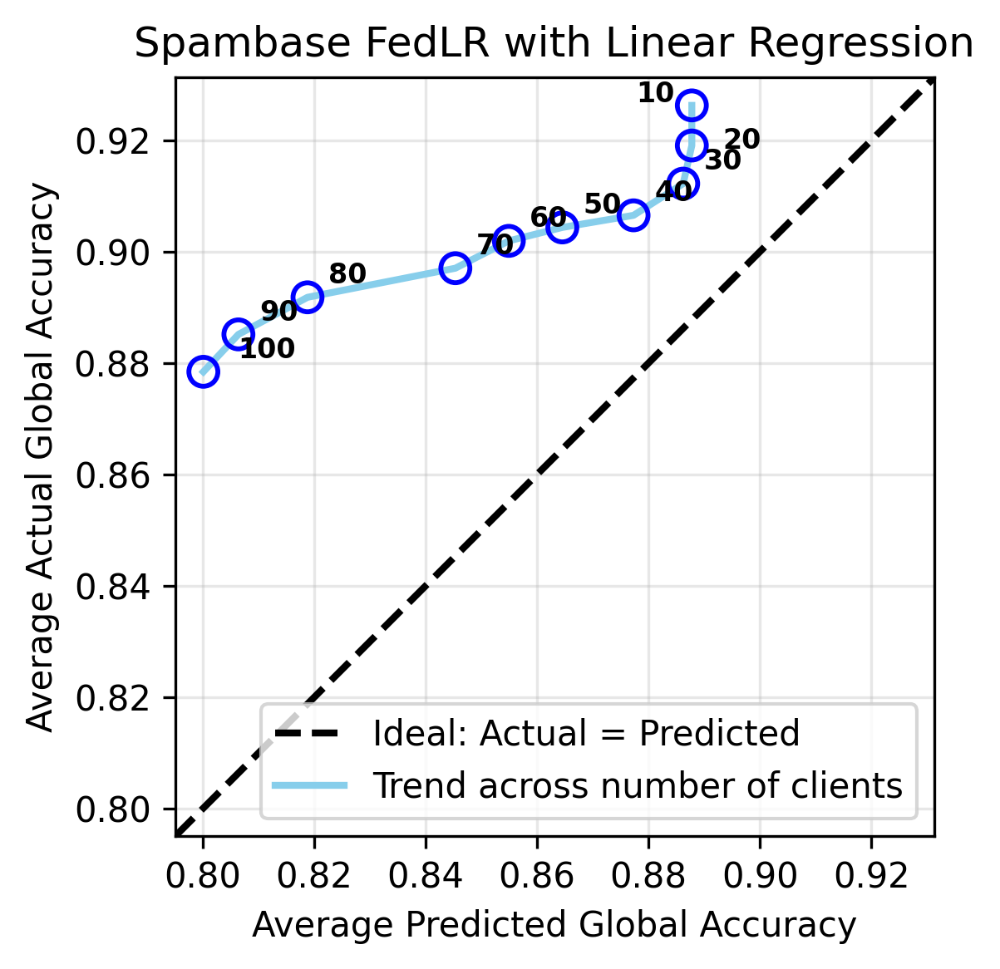
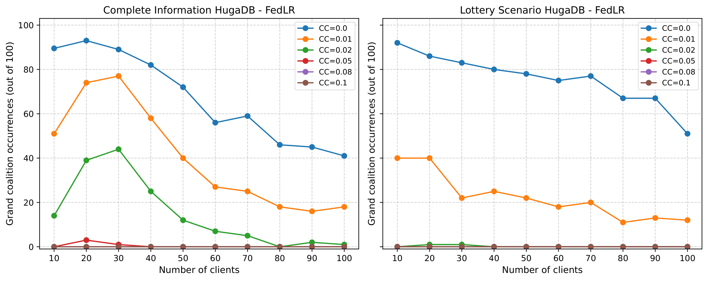
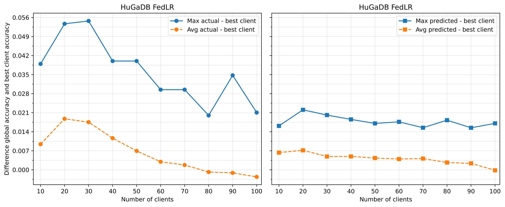

With `/src/spambase_fedlr_bias.ipynb`, you can generate results from our **initial approach**, where we tried to evaluate our estimators.  
For example, in the case of *Spambase*, the estimator turned out to be **too optimistic**.



---


Then, you can use `plots.ipynb` to generate Part 1 and Part 2 results. 
It is located in the `src/` directory.


## 🔹 Part 1: Grand Coalition Occurrence Plots

**Function**  
```python
plot_coalition_results(base_save_dir, dataset_name, approach_name)
````

This function loads result CSVs from the `base_save_dir` and plots the number of times the **grand coalition** was NE under two scenarios:

* **Complete information**
* **Lottery-based information**

The figures show how grand coalition occurrences vary with:

* Communication cost
* Number of clients

**Output**
All plots are saved in the `figs/` directory with the filename format:

```
datasetname_approachname.pdf like hugadb_fedlr.pdf
```

**Example Output Figure**




---

## 🔹 Part 2: Global vs Best Client Accuracy Differences

**Function**

```python
plot_global_vs_best_accuracy(dataset_name, approach_name, dataset_name_, approach_name_, base_dir)
```

This function compares the **global model's accuracy** to the **best individual client's accuracy** for each configuration. It computes:

* **Maximum** difference across 100 trials (the maximum difference observed across 100 trials)
* **Average** difference across 100 trials (the average of all 100 differences computed across trials)

The comparison is done for both:

* Complete information
* Lottery-based information

**Output**
All plots are saved in the `figs/` directory with the filename format:

```
datasetname_approachname_plots.pdf like hugadb_fedlr_plots.pdf
```

  **Example Output Figure**



* Summary statistics also are saved in the `summary/` directory:

  ```
  datasetname_approachname_all.csv like hugadb_fedlr_all.csv
  ```


---
